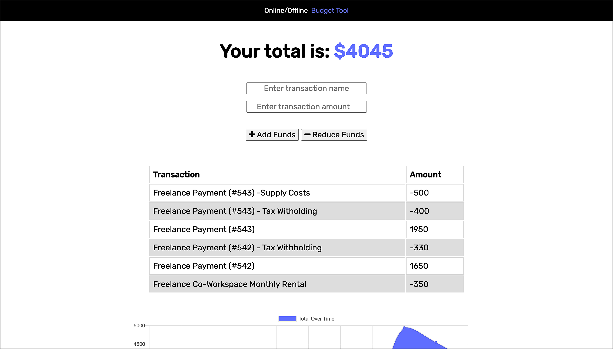
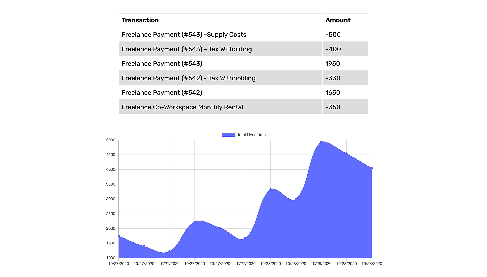

# Online/Offline Budget Tool
‎
‎‎ 

 

      
  

  ---
  
  
&nbsp;

    

## Description 

&nbsp;

<strong><em>What is this project? Why did you make this project? How did you make this project?</strong></em>

&nbsp;

This project is an intuitive budgeting tool that allows a user to keep track of their deposits and expenses. These entries are stored in a table format with their provided description and amount, and visualized over time in a date stamped line chart as well (Thanks to `Chart.js`). This is a progressive web application that can be used both online, and offline if necessary. In the event that a connection is lost during use, transaction entries will be stored temporarily in `IndexedDB` "pending" storage, and then permanently added to the `MongoDB` database once a connection can be established again. A `Service Worker` file provides a cached version of the website when using offline so the user interface can continue to be utilized during an outage. This provides reliability at all times, specifically during moments of unpredictable connectivity or during travel when data/wifi might not necessarily be available in the moment. This responsive application is optimized for all screen sizes and it's capabilities can be enjoyed in both a mobile or desktop setting.

&nbsp;

View the application here =>‏‏‎ ‎‏‏‎ ‎‏‏‎ ‎‏‏[`Online/Offline Budget Tool`](https://onlineoffline-budget-app.herokuapp.com/)

&nbsp;

---

&nbsp;

## Table of Contents: 

&nbsp;

* [Usage](#usage)
* [License](#license)
* [Credits](#credits)
* [Questions](#questions)

&nbsp;

---

&nbsp;

## Usage

&nbsp;

<strong><em>Instructions and examples for usage + development details:</strong></em>

&nbsp;

Log on to:‏‏‎ ‎‏‏‎ ‎‎‏‏[`Online/Offline Budget Tool`](https://onlineoffline-budget-app.herokuapp.com/). Get started by simply adding a description of your budgetary item and the value associated. If this is an expense then select the "- Reduce Funds" submit button, and use the "+ Add Funds" submit button for all deposits. After submitting you'll see a live update of your entry populate on a table directly below, and the line chart will update displaying the visualization for said entry as well. The application will scroll into view below automatically upon submit, giving you the exact view of this data. Feel free to add more entries when neeeded. 

&nbsp;

&nbsp;

 

&nbsp;

--- 

&nbsp;

 

&nbsp;

 

---

&nbsp;

&nbsp;
  

---

&nbsp;

## License

&nbsp;

This project is covered under the MIT license. 

&nbsp;

---

&nbsp;

## Credits

&nbsp;

<strong><em>Third party assets:</strong></em>

&nbsp;

`Node.js` =>‏‏‎ ‎ ‏‏‎ ‎[An asynchronous event-driven runtime built on Chrome's V8 JavaScript engine.](https://nodejs.org/en/)

&nbsp;‏‏‎‏‏‎ ‎<strong>+</strong>

`Express.js` =>‏‏‎ ‎ ‏‏‎ ‎[A fast, unopinionated, minimalist web framework for Node.js.](https://expressjs.com/)

&nbsp;‏‏‎‏‏‎ ‎<strong>+</strong>

`MongoDB` =>‏‏‎ ‎ ‏‏‎ ‎[The most popular databse for modern apps.](https://www.mongodb.com/)

&nbsp;‏‏‎‏‏‎ ‎<strong>+</strong>

`Mongoose npm` =>‏‏‎ ‎ ‏‏‎ ‎[A MongoDB object modeling tool designed to work in an asynchronous environment. ](https://www.npmjs.com/package/mongoose)

&nbsp;‏‏‎‏‏‎ ‎<strong>+</strong>

`Chart.js` =>‏‏‎ ‎ ‏‏‎ ‎[Simple yet flexible JavaScript charting for designers & developers.](https://www.chartjs.org/)

&nbsp;‏‏‎‏‏‎ ‎<strong>+</strong>

`Bootstrap CDN` =>‏‏‎ ‎ ‏‏‎ ‎[An pen-source CSS framework directed at responsive, mobile-first front-end web development.](https://getbootstrap.com/)

&nbsp;‏‏‎‏‏‎ ‎<strong>+</strong>

`Heroku` =>‏‏‎ ‎ ‏‏‎ ‎[A platform that enables developers to build, run, & operate applications entirely in the cloud.](https://www.heroku.com)

&nbsp;‏‏‎‏‏‎ ‎<strong>+</strong>

`Compression npm` =>‏‏‎ ‎ ‏‏‎ ‎[Node.js compression middleware.](https://www.npmjs.com/package/compression)

&nbsp;‏‏‎‏‏‎ ‎<strong>+</strong>

`JSCompress` =>‏‏‎ ‎ ‏‏‎ ‎[An online JavaScript compressor that allows you to minify files by up to 80%.](https://jscompress.com/)

&nbsp;‏‏‎‏‏‎ ‎<strong>+</strong>

`Morgan npm` =>‏‏‎ ‎ ‏‏‎ ‎[HTTP request logger middleware for node.js that is named after Dexter.](https://www.npmjs.com/package/morgan)

&nbsp;

---

&nbsp;

## Questions?

&nbsp;

Shoot me an e-mail! => jonathan@jonathanschimpf.com

&nbsp;

Check out more of my work here on =>
[GitHub](http://github.com/jonathanschimpf)

&nbsp;

